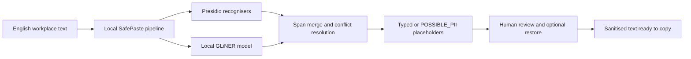

# SafePaste

SafePaste is a local-first prototype that checks English workplace text for personally identifiable information before it is pasted into a public AI assistant. It combines Presidio-based pattern recognizers for structured identifiers with an optional locally stored GLiNER model for contextual entities such as people and addresses. Detected spans are replaced with reversible placeholders and uncertain model results are shown as `[POSSIBLE_PII_n]`.

This repository implements the scope stated in the PE6201 milestone. PrivacyScrubber is prior work and positioning context; this code is not a fork of PrivacyScrubber. The implementation owns orchestration, review, reversible masking and evaluation, while allowing Presidio/GLiNER to be reused as local detection components.

## Product overview

Persona: Tonya, an e-commerce support agent who wants to use a public AI assistant without accidentally pasting customer PII.

Problem: support messages can contain names, emails, phone numbers, addresses and local identifiers. Manual spotting is error-prone when the agent is moving quickly.

Input: one English workplace or support message.

Output: sanitised text, detected spans, typed placeholders such as `[PERSON_1]`, uncertainty placeholders such as `[POSSIBLE_PII_1]`, and a reversible restore map for user review.

Scope: English workplace text before AI upload. SafePaste is a risk-reduction review step, not a security guarantee.

Non-goals: trade-secret detection, legal compliance decisions, multilingual DLP, enterprise DLP replacement and production access-control enforcement.

## High-level architecture



Presidio and GLiNER are reused local detection components. SafePaste implements the UI, orchestration, overlap handling, abstention, redaction, restore map and evaluation. During inference, the application does not call a cloud LLM. RAG and agent planning are not used because this task is span detection and masking, not knowledge synthesis or tool planning.

## Run SafePaste on a new machine

Open PowerShell in the repository root. These commands use Python 3.10 or newer. A Conda environment is optional; activate one first if you use Conda.

```powershell
python -m pip install -e ".[ml]"
python -c "from huggingface_hub import snapshot_download; snapshot_download(repo_id='urchade/gliner_multi_pii-v1', local_dir='models/gliner_multi_pii-v1')"
Copy-Item .env.example .env
python -m safepaste.cli analyze "Hi, I am Mei Tan. Call me at +65 9123 4567." --mode hybrid
python -m safepaste.server --mode hybrid
```

Run the commands from the repository root: `.env.example` points to the relative `models/gliner_multi_pii-v1` directory. The model is downloaded during setup; its weights are not stored in this repository. The first analysis loads the model and can take several seconds. Confirm that the CLI output has `warnings: []` and includes a `gliner` span before presenting the Hybrid demo. Then open `http://127.0.0.1:8765`. The server listens on the local loopback interface.

The browser has **Check and mask**, **Copy sanitised text**, and **Restore all** controls. The source text and restore map stay in the local browser/server exchange; the application does not call a cloud LLM during analysis. The restore map contains original PII, so do not log or share it.

If you need only the structured-PII baseline, install `python -m pip install -e .` and run `python -m safepaste.server --mode presidio`; this path does not need model weights. In Hybrid mode, a missing model produces an explicit warning and a Presidio-only result. Such a result must not be presented as full Hybrid coverage.

Supported modes are `presidio` (structured-PII baseline), `gliner` (contextual detector), and `hybrid` (both). `regex` is a compatibility alias for `presidio`; `regex-legacy` is an older debugging implementation and is not part of the formal three-system comparison.

The interactive server/CLI currently use GLiNER thresholds `0.55` (typed) and `0.35` (abstention). The **reported formal experiments** use the frozen `configs/final_experiment.json` values `0.55` and `0.40`. The website demonstrates the workflow; use the experiment script and frozen config below to reproduce the result tables. Do not treat a one-message website output as a reproduction of the aggregate metrics.

## Evaluation

The evaluator reports the four combinations requested by the instructor:

- exact typed recall
- exact protective recall (includes abstentions)
- overlap typed recall
- overlap protective recall (includes abstentions)

It also reports precision and abstention rate. Predictions are matched one-to-one with gold spans, preventing duplicate predictions from inflating a score.

```powershell
$env:PYTHONPATH = "src"
python -m safepaste.cli evaluate data/singapore_stress.json --mode presidio
```

The 30 hand-authored Singapore-style examples are fictional and must remain a separate stress set. Do not tune thresholds or patterns against them if they are being reported as an independent test.

### Formal experiment commands

The final configuration is frozen in `configs/final_experiment.json`. After this file is frozen, do not change detector rules, thresholds, label mapping, overlap resolution or metrics based on frozen results.

```powershell
python scripts\run_experiment.py --dataset data\ai4privacy_split\frozen_evaluation_3000.json --system presidio --config configs\final_experiment.json --output results\runs\presidio_frozen
python scripts\run_experiment.py --dataset data\ai4privacy_split\frozen_evaluation_3000.json --system gliner --config configs\final_experiment.json --output results\runs\gliner_frozen
python scripts\run_experiment.py --dataset data\ai4privacy_split\frozen_evaluation_3000.json --system hybrid --config configs\final_experiment.json --output results\runs\hybrid_frozen

python scripts\run_experiment.py --dataset data\singapore_stress.json --system presidio --config configs\final_experiment.json --output results\runs\presidio_stress
python scripts\run_experiment.py --dataset data\singapore_stress.json --system gliner --config configs\final_experiment.json --output results\runs\gliner_stress
python scripts\run_experiment.py --dataset data\singapore_stress.json --system hybrid --config configs\final_experiment.json --output results\runs\hybrid_stress
```

Each run writes `config.json`, `predictions.jsonl`, `metrics.json`, `errors.jsonl`, `runtime.json` and `run.log`.

### Final results

Original target: 80% exact-span recall and better performance than the rule-only baseline.

AI4Privacy frozen evaluation, 3,000 records:

| System | Exact typed R | Exact protective R | Overlap typed R | Overlap protective R | Exact typed P | Abstention |
|---|---:|---:|---:|---:|---:|---:|
| Presidio-only | 15.46% | 19.74% | 16.36% | 21.85% | 68.55% | 0.00% |
| GLiNER-only | 11.60% | 17.98% | 17.59% | 28.04% | 23.41% | 14.61% |
| Hybrid | 26.98% | 37.03% | 33.85% | 47.44% | 38.41% | 10.05% |

Singapore-style stress set, 30 fictional hand-authored support messages:

| System | Exact typed R | Exact protective R | Overlap typed R | Overlap protective R | Exact typed P | Abstention |
|---|---:|---:|---:|---:|---:|---:|
| Presidio-only | 43.40% | 43.40% | 60.38% | 60.38% | 60.53% | 0.00% |
| GLiNER-only | 50.94% | 54.72% | 50.94% | 56.60% | 72.97% | 5.13% |
| Hybrid | 92.45% | 94.34% | 94.34% | 96.23% | 81.67% | 1.64% |

The 80% target was not reached on the broad AI4Privacy frozen benchmark. Hybrid still substantially improves recall over either single detector. On the project-specific Singapore support-text stress set, Hybrid reaches 96.23% overlap protective recall.

The stress set is closer to the target support-agent scenario, but it has only 30 fictional hand-authored records. It must not be treated as production performance proof.

V1 above is the official frozen result. The separate V2 mapping was defined **after** examining V1 and re-scores the saved predictions for a narrower product scope. Its Hybrid overlap protective recall is 65.14% on AI4Privacy; it is a diagnostic sensitivity analysis, not a replacement for V1 or evidence that the 80% target was met. See `docs/V2_PRODUCT_SCOPE_MAPPING.md`.

Generated analysis artifacts:

- `results/main_results.csv`
- `results/per_label_results.csv`
- `results/singapore_stress_results.csv`
- `results/error_categories.csv`
- `results/representative_errors.json` (generated locally; row-level source excerpts are not redistributed)
- `results/runtime_summary.json`
- `results/report_tables.md`
- `results/report_tables_v2.md` for the separate post-evaluation product-scope mapping view

## Prepare the AI4Privacy split

The milestone names `ai4privacy/pii-masking-300k` as the source. The dataset's license permits academic, non-commercial use but requires written permission for redistribution and sharing derivative data. The public repository therefore provides the split script, seed, audit summary and SHA-256 hashes; download and generate the 2,000/3,000 source records locally. The 30 fictional Singapore examples are authored within this project and are included. See `data/README.md` for the exact hashes and mapping.

To regenerate the AI4Privacy split locally, install the data dependency and run:

```powershell
python -m pip install -e ".[data]"
python scripts/prepare_ai4privacy.py --output data/ai4privacy_split --seed 6201
```

The script uses a deterministic reservoir sample. Network access is needed for the initial data and model downloads, not for subsequent local inference. The full frozen run commands above take substantially longer than the one-message demo. Per-record predictions and text excerpts generated from AI4Privacy remain local unless you obtain redistribution permission; the aggregate tables and evaluation code document the submitted findings.

## Documentation map

- `data/README.md`: dataset source, split, record format, label mapping, audit notes and hashes.
- `docs/EVALUATION.md`: system definitions, metric definitions, frozen commands and evaluation limitations.
- `docs/V2_PRODUCT_SCOPE_MAPPING.md`: post-evaluation V2 mapping rationale and results.
- `docs/experiment_log.md`: chronological experiment and documentation log.
- `docs/final_analysis.md`: final business and technical analysis report.
- `results/README.md`: result artifact guide.
- `results/report_tables.md`: report-ready Markdown tables.
- `models/README.md`: local model storage notes.

## Project structure

- `src/safepaste`: detectors, hybrid orchestration, reversible redaction, evaluator, CLI and local web UI
- `data/singapore_stress.json`: 30 fictional Singapore support messages with character spans
- `scripts/prepare_ai4privacy.py`: deterministic AI4Privacy sample preparation
- `scripts/run_experiment.py`: reproducible batch experiments for Presidio-only, GLiNER-only and Hybrid
- `scripts/analyse_errors.py`: per-label metrics, error categories and representative examples
- `tests`: unit and integration tests using Python's standard library

## Tests

From the project root:

```powershell
conda activate safepaste
$env:PYTHONPATH = "src;."
python -m unittest discover -s tests -v
```

## Important limitations

- Presidio-only mode cannot reliably identify contextual names and addresses.
- GLiNER results depend on the selected model, label vocabulary and threshold.
- `[POSSIBLE_PII]` improves protective coverage but is not counted in typed recall.
- The AI4Privacy benchmark is synthetic and broader than the Tonya support-text scenario.
- The current system is English-focused and tuned for local structured PII plus person/address detection.
- SafePaste does not detect trade secrets, make legal compliance decisions or replace enterprise DLP.
- The restore map itself contains the original PII and must not be logged or persisted.
